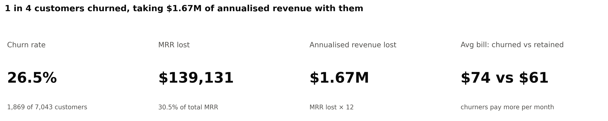
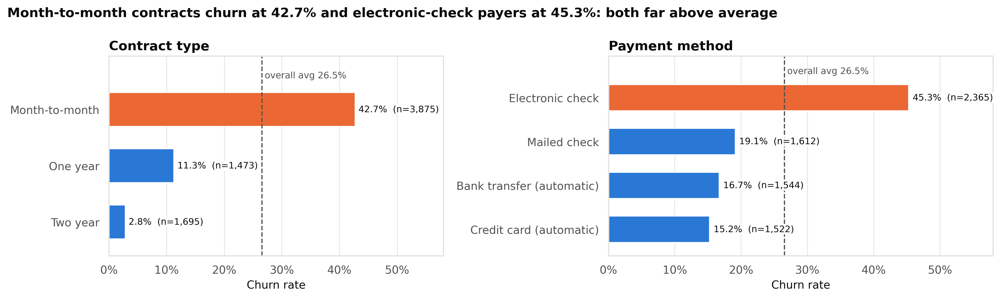
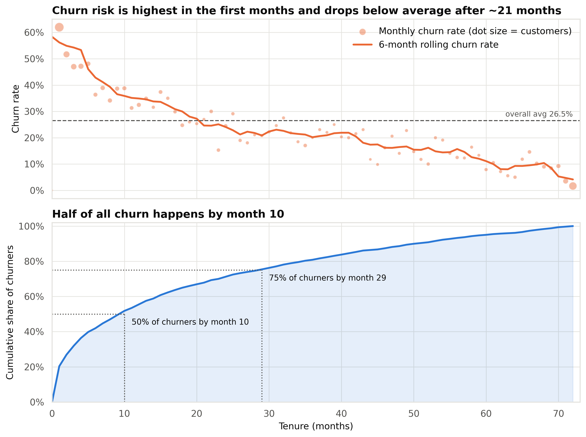
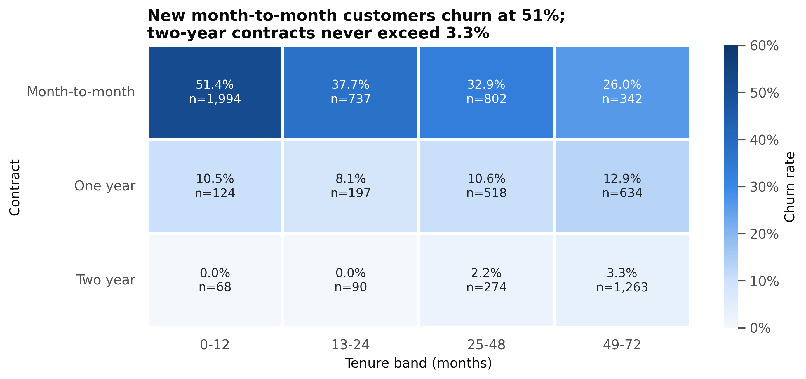
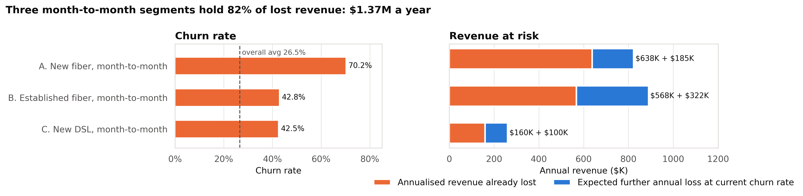
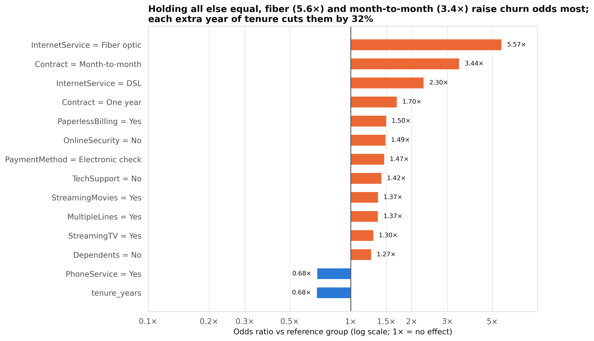

# Telecom Customer Churn Analysis

**Which customers are churning, why, and how much revenue is at risk?**

An end-to-end analysis of 7,043 telecom customers. It sizes the churn problem, finds the drivers, pinpoints the segments where retention spend pays back most, and validates the findings with a simple, explainable model.



---

## Business problem

A telecom provider is losing roughly one in four customers. The retention team has a limited budget and needs to know:

1. **How big is the problem?** How many customers and how much recurring revenue are lost?
2. **Why are customers leaving?** Which contract, billing and product factors are linked to churn?
3. **Where should we act first?** Which segments combine high churn with high value, and what is the revenue at stake?

## Dataset

- **Source:** [IBM Telco Customer Churn](https://www.kaggle.com/datasets/blastchar/telco-customer-churn) (IBM sample data, distributed via Kaggle)
- **Size:** 7,043 customers × 21 columns, saved here as `data/raw/Telco-Customer-Churn.csv`
- **Contents:** demographics, account details (tenure, contract, billing, payment), subscribed services, monthly and total charges, and whether the customer churned **within the last month**

## Methodology

| Step | Notebook | What was done |
|---|---|---|
| 1. Cleaning | [`01_cleaning`](notebooks/01_cleaning.ipynb) | Converted `TotalCharges` to numeric. The 11 blanks were all tenure-0 customers who hadn't been billed yet, so they were set to 0 rather than dropped. Standardised labels, added a 0/1 churn flag, checked duplicates and category labels, and engineered `tenure_band`, `num_services`, `has_streaming` and `avg_monthly_spend`. No rows were lost (7,043 in, 7,043 out). |
| 2. Overview | [`02_churn_overview`](notebooks/02_churn_overview.ipynb) | Headline KPIs (churn rate, MRR lost, annualised revenue lost) and churn by gender, senior status, partner and dependents |
| 3. Drivers | [`03_churn_drivers`](notebooks/03_churn_drivers.ipynb) | Sorted churn-rate charts against the overall average, churn vs tenure curve, and chi-square tests with Cramér's V for effect size |
| 4. Segments & value | [`04_segments_and_value`](notebooks/04_segments_and_value.ipynb) | Monthly charges for churned vs retained (violin plot and Mann-Whitney U test), contract × tenure heatmap, a risk-vs-value segment map, revenue at risk for 3 priority segments, and a correlation heatmap |
| 5. Modelling | [`05_modelling`](notebooks/05_modelling.ipynb) | Logistic regression with a stratified 75/25 split, a standard and a class-weighted version, recall-focused evaluation, ROC-AUC, and odds ratios explained in business terms |

**Revenue definitions.** *MRR lost* is the sum of churned customers' monthly charges. *Annualised revenue lost* is MRR lost × 12.

---

## Headline findings

**1. 26.5% of customers churned, taking $1.67M of annualised revenue with them.**
1,869 of 7,043 customers left, removing **$139,131 of monthly recurring revenue**, or 30.5% of the $456,117 base. Churners paid more than average: **$74.44/month vs $61.27** for retained customers.

**2. Contract type is the #1 driver.** Month-to-month customers churn at **42.7%**, against **11.3%** on one-year and **2.8%** on two-year contracts. Month-to-month accounts for 87% of lost MRR. Contract is the strongest association in the data (Cramér's V = 0.41), and the model puts month-to-month at **3.44× the churn odds** of a two-year contract.



**3. The first year is the danger zone.** **47.4%** of customers in their first 12 months churn, compared with 9.5% after four years. **Half of all churners leave by month 10.** In the model, each extra year of tenure cuts churn odds by **32%**.



**4. Fiber customers without support add-ons are the most likely to leave.** Fiber optic customers churn at **41.9%** (vs 19.0% on DSL), even though they pay the most ($91.50/month on average). Customers without **online security churn at 41.8%** (vs 14.6% with it), and those without **tech support at 41.6%** (vs 15.2%). Paying by **electronic check** brings a **45.3%** churn rate and $1.01M a year in lost revenue.



**5. Three month-to-month segments hold 81.8% of lost revenue: $1.37M a year.** These segments contain 40% of customers but 77.8% of churners. Another **$608K a year** is expected to be lost from the customers still in them if churn rates hold.

| Segment | Customers | Churn rate | Avg bill | Annual revenue lost | Expected further annual loss |
|---|---:|---:|---:|---:|---:|
| **A.** New fiber (≤12 mo), month-to-month | 916 | 70.2% | $82.08 | $638,140 | $185,360 |
| **B.** Established fiber (13+ mo), month-to-month | 1,212 | 42.8% | $90.76 | $567,644 | $322,162 |
| **C.** New DSL (≤12 mo), month-to-month | 690 | 42.5% | $47.88 | $160,223 | $100,322 |



**What the model adds.** A class-weighted logistic regression catches **79% of churners** (recall) with ROC-AUC 0.84. The top 20% of customers by predicted risk contain **half of all churners**, a 2.5× lift over random targeting. Holding other factors constant, **fiber (5.57×)** and **month-to-month (3.44×)** have the largest odds ratios.



---

## Recommendations

| Priority | Segment | Action | Estimated annual revenue saved | Assumptions |
|---|---|---|---:|---|
| 1 | **B. Established fiber, month-to-month** (1,212 customers, $90.76 avg bill) | Offer a one- or two-year contract upgrade with a 10% loyalty discount and price lock. Two-year customers churn at 2.8%. | **$127,720** | 25% of this segment's would-be churners (≈130 customers) accept and stay; 10% discount deducted from the revenue they keep. Basis: $567,644 lost per year. |
| 2 | **A. New fiber, month-to-month** (916 customers, 70.2% churn) | Structured 90-day onboarding: proactive check-in calls in months 1-3, 6 months of free tech support and online security (91% currently have no tech support), and an autopay sign-up incentive (69% pay by electronic check). | **$127,628** | 20% of would-be churners (≈129 customers) are retained. Basis: $638,140 lost per year. Add-on and incentive costs are not deducted. |
| 3 | **C. New DSL, month-to-month** (690 customers, 42.5% churn) | A lower-cost version of the onboarding programme: welcome call, autopay incentive and a first-year contract discount. | **$24,033** | 15% of would-be churners (≈44 customers) are retained. Basis: $160,223 lost per year. |
| Ongoing | **All customers paying by electronic check** (45.3% churn) | Run an autopay migration campaign (one-off bill credit for switching). Automatic card or bank payers churn at 15-17%. | Not added to the total | This overlaps with segments A-C, so it is not counted separately to avoid double counting. |
| Ongoing | **All customers** | Score customers monthly with the churn model and send the top 20% by risk to the retention team. | Enables the above | The top 20% by predicted risk hold 50% of churners. |

**Total estimated saving for segments A-C: $279,381 a year.** This is about 20% of the $1.37M these segments lose today.

How sensitive this is to the save rate, applied evenly across A-C before discounts:

| Save rate | Annual revenue saved |
|---:|---:|
| 10% | $136,601 |
| 20% | $273,201 |
| 30% | $409,802 |

> **Note:** these are planning estimates, not forecasts. The save rates are illustrative assumptions, not measured outcomes. Each programme should be piloted as an A/B test before it is scaled, and the savings above are gross, before campaign costs.

---

## Limitations

- **Snapshot data, not a cohort.** Churn is measured over a single month, so the tenure curve is "survival-style" rather than a true survival analysis. Annualising assumes one month's loss is representative of the year.
- **Correlation, not causation.** For example, the add-on effects may reflect *engaged* customers who choose to buy add-ons, rather than the add-ons themselves preventing churn. Experiments are needed to confirm what works.
- **Missing context.** The dataset has no information on customer service contacts, network quality, competitor offers or pricing changes, so the reasons behind the high fiber churn can only be inferred.
- **Illustrative save rates.** The recommendation savings rest on assumed save rates and do not net out campaign costs.
- **Sample data.** This is an IBM sample dataset of about 7,000 customers from a fictional provider. The methods transfer to real data, but the exact figures should not be generalised.
- **Simple model by design.** Logistic regression was chosen for explainability. Tree-based models might gain a few points of AUC but would be harder to explain to the business.

## How to run

```bash
git clone <repo-url>
cd Customer-Churn-Analysis

python -m venv .venv
# Windows: .venv\Scripts\activate    macOS/Linux: source .venv/bin/activate
pip install -r requirements.txt

# Run every notebook end to end (01 must run first: it creates data/processed/clean.csv)
cd notebooks
jupyter nbconvert --to notebook --execute --inplace 01_cleaning.ipynb 02_churn_overview.ipynb 03_churn_drivers.ipynb 04_segments_and_value.ipynb 05_modelling.ipynb
```

Charts are saved to `images/` as 300 dpi PNGs.

## Project structure

```
├── data/
│   ├── raw/Telco-Customer-Churn.csv        # original dataset
│   └── processed/
│       ├── clean.csv                       # output of notebook 01
│       └── priority_segments.csv           # output of notebook 04
├── notebooks/
│   ├── 01_cleaning.ipynb
│   ├── 02_churn_overview.ipynb
│   ├── 03_churn_drivers.ipynb
│   ├── 04_segments_and_value.ipynb
│   └── 05_modelling.ipynb
├── src/churn_utils.py                      # shared theme, palette and chart helpers
├── images/                                 # exported charts (300 dpi PNG)
├── requirements.txt
└── README.md
```

## Tech stack

- **Python 3.10**
- **pandas** and **numpy** for data wrangling
- **matplotlib** and **seaborn** for charts (one shared theme and colour-blind-safe palette, defined in `src/churn_utils.py`)
- **SciPy** for the chi-square and Mann-Whitney U tests
- **scikit-learn** for logistic regression and evaluation metrics
- **Jupyter** notebooks
